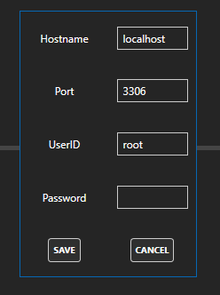
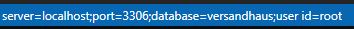
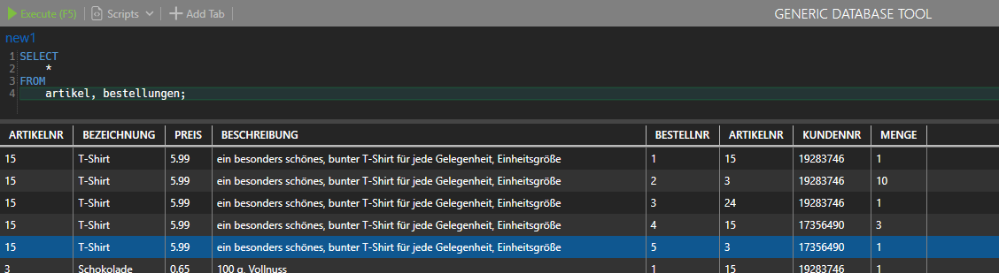
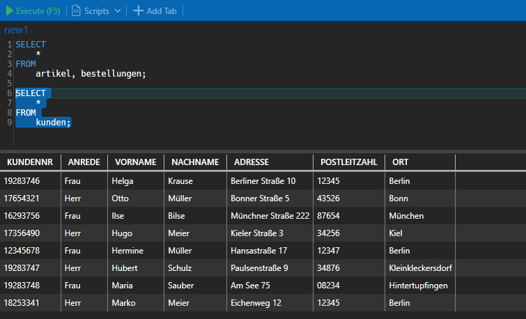

- [Features](#features)
  - [Mit einem Datenbankserver verbinden](#mit-einem-datenbankserver-verbinden)
  - [Eine Datenbank auswählen](#eine-datenbank-auswählen)
  - [Übersicht der Tabellen anzeigen](#übersicht-der-tabellen-anzeigen)
  - [Eine MySql Query ausführen](#eine-mysql-query-ausführen)
  - [Exportieren der Ergebnistabelle](#exportieren-der-ergebnistabelle)

# Features
## Mit einem Datenbankserver verbinden
Standardmäßig wird localhost verwendet, wie im Config-Fenster zu sehen:

In diesem Falle müsste also eine MySql Datenbank unter localhost:3306 mit dem Benutzer "root" zu erreichen sein. Die Config Daten können jederzeit angepasst und gespeichert werden. Auch nach einem Neustart des Programms sind diese dann verfügbar.

## Eine Datenbank auswählen
Über das Dropdown Menü kann man eine Datenbank auswählen. Das man sich erfolgreich verbunden hat sieht man an dem Connection string unten links in der Statusleiste:

## Übersicht der Tabellen anzeigen
Es ist möglich sich eine Übersicht von Tabellen der ausgewählten Datenbank anzeigen zu lassen. Nachdem eine Datenbank ausgewählt wurde, erscheint der Button "Tables" oben rechts. 

Hiermit kann eine Übersicht an der rechten Seite angezeigt werden.

## Eine MySql Query ausführen
Es wird immer das MySql aus dem Tab ausgeführt, in dem man sich aktuell befindet. 
Falls ein Teil der Query markiert wird, wird nur dieser Teil ausgeführt.

Beispiel ohne Markierung: 

Beispiel mit Markierung:
Hier sieht man das die Kunden ausgegeben werden, da auch nur das Kunden-Select markiert wurde.

## Exportieren der Ergebnistabelle
Mit einem Rechtsklick auf die Ergebnistabelle können die Daten als JSON oder CSV Datei exportiert werden.

      

-- Thomas Krüssel